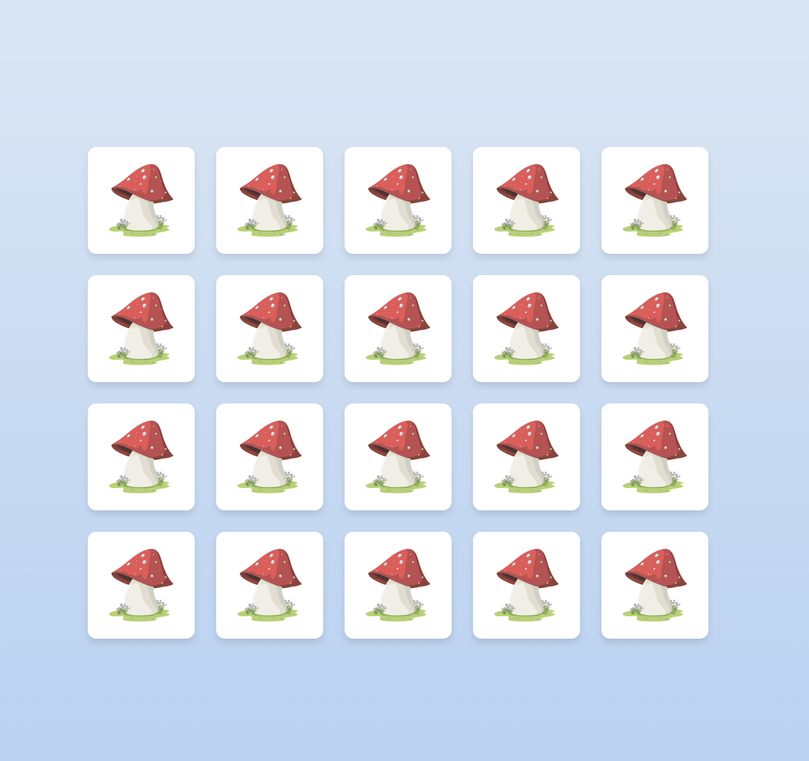
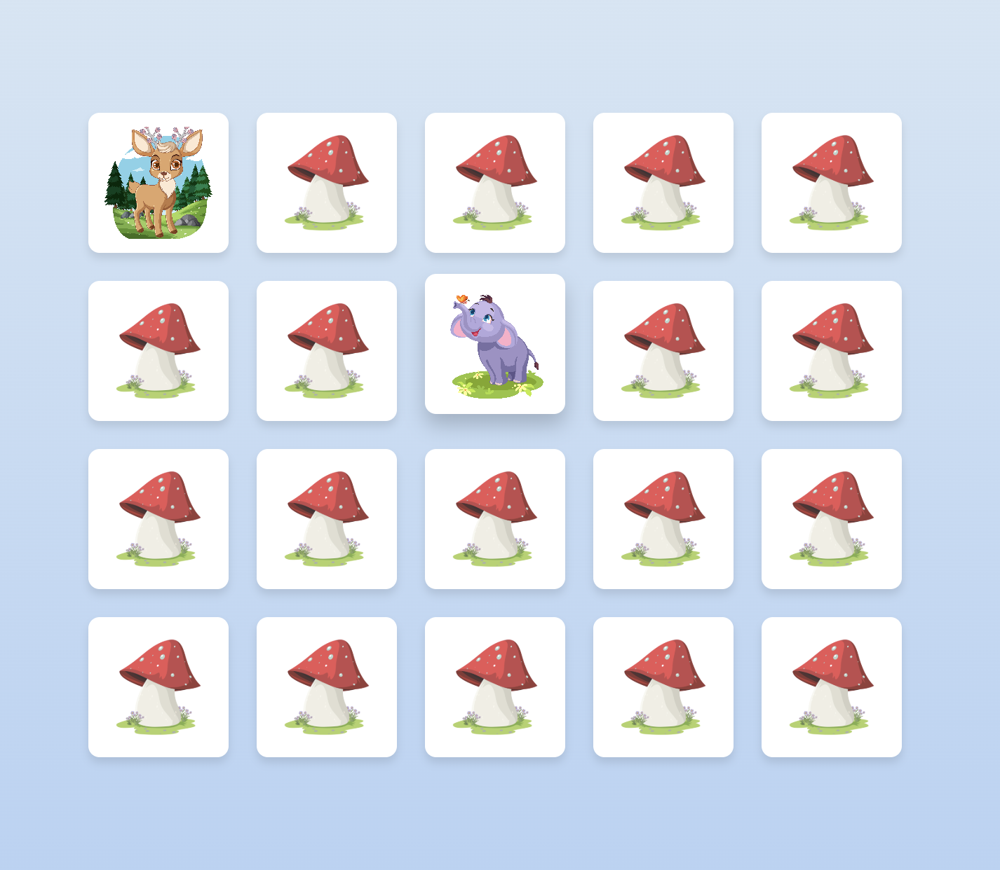
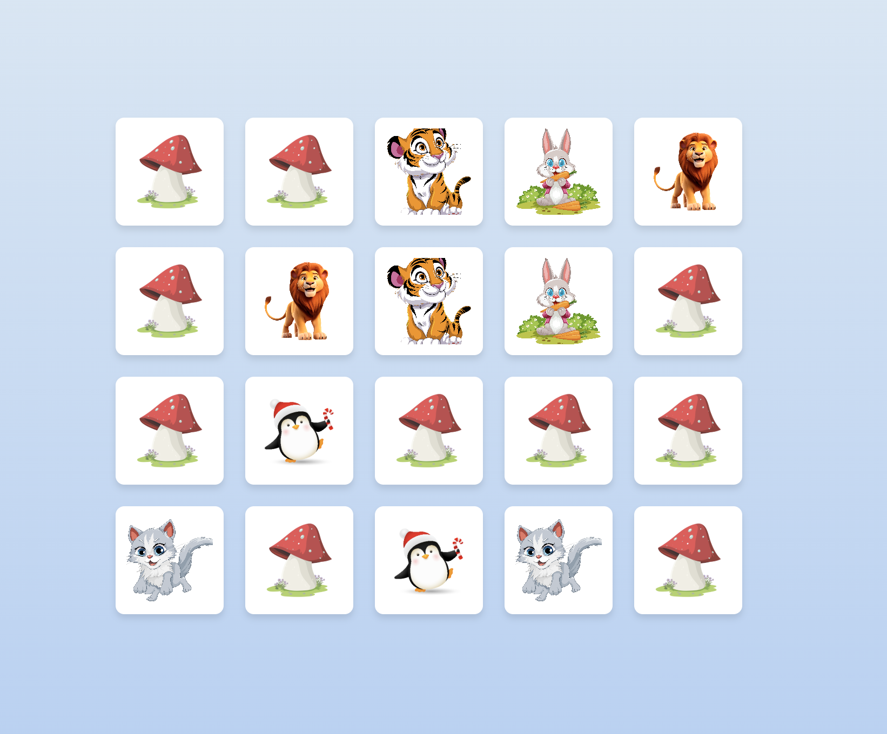
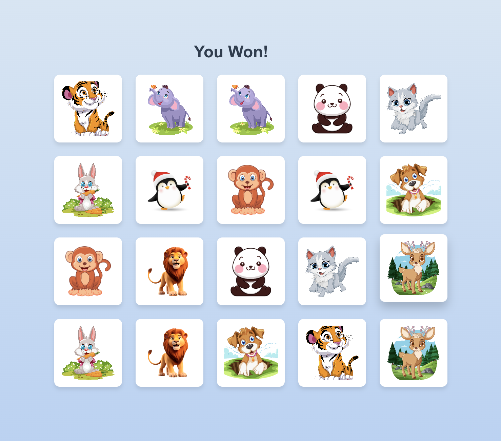

# Prerequisites
**ReactJS**: React is a JavaScript library created by Facebook. It is widely used for building dynamic and responsive user interfaces. React works by breaking the UI into reusable components, allowing developers to manage complex interfaces efficiently.

**Features of React**:
- Component-based architecture.
- Virtual DOM for faster rendering.
- Extensive ecosystem with libraries and tools.

---

# How to Run?

1. Clone the repository to your local machine using:
    `git clone https://github.com/lohi212/Matching-Card-Game.git`

2. Navigate to the project directory:
    `cd Matching-Card-Game`

3. Install the required dependencies using Yarn:
    `yarn install`

4. Start the development server:
    `yarn start`

5. Open your browser and navigate to `http://localhost:3000`.

---

# How to Play?

**Goal**: Match all the pairs of cards to win the game.

### Instructions:
1. **Flip Cards**: Click on any card to flip it and reveal its image.
2. **Match Pairs**: Find and select the matching card from the grid. 
3. **Non-matching Pairs**: If the cards don’t match, they will flip back after a brief delay.
4. **Winning**: Once all pairs are matched, you will see a "You Won!" message.

### Example Gameplay:

#### 1. Initial Grid:

#### 2. Flipping Cards:

#### 3. Matching Pair:

#### 4. Winning the Game:

### Tips:
- Try to memorize the positions of flipped cards for better chances of matching pairs quickly.
- Have fun!

---

# Credits
Developed with ❤️ using ReactJS.